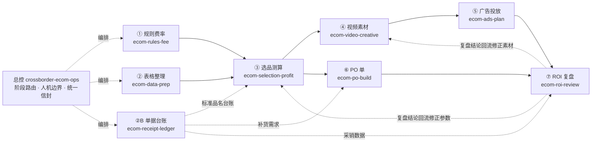

# 技能运行链路：从触发到交付

这份文档回答一个问题：**一次真实的运营任务，这些技能是按什么顺序跑起来的、每一步吃什么进、吐什么出、在哪里必须停下来等人。**

技能不是每次都要全跑一遍。真实用法是「按业务触发，按依赖串联」：问费率就只跑 ①，要周报就从 ⑦ 进，做新品就按 ①→②→③→④→⑤ 走。

## 一、入口判断：用户说什么，进哪个技能

| 用户想干的事 | 入口技能 | 典型说法 |
|---|---|---|
| 查平台规则、费率、税务、禁限售 | `ecom-rules-fee` | 「TikTok Shop 越南站佣金多少」「这单实际到手多少钱」 |
| 把后台导出的乱表洗干净 | `ecom-data-prep` | 「这几张表合并一下」「表头对不上」「去重」 |
| 手写采购/销售单据要电子化、对账 | `ecom-receipt-ledger` | 「拍照记账」「存根簿电子化」「今天采销对不上」 |
| 判断某个品能不能做、定价多少 | `ecom-selection-profit` | 「这个品有利润吗」「保本价怎么算」 |
| 出广告脚本、视频提示词 | `ecom-video-creative` | 「给这个产品出条 15 秒脚本」「前三秒怎么留住人」 |
| 设计投放结构、预算、出价、节奏 | `ecom-ads-plan` | 「这套素材怎么投」「预算怎么分」「什么时候放量」 |
| 做采购订单、下单前校验 | `ecom-po-build` | 「帮我做 PO 单」「这批货下多少」 |
| 复盘投放效果、写周报 | `ecom-roi-review` | 「ROAS 掉了为什么」「帮我写复盘周报」 |
| 不知道该走哪条 / 要端到端 | `crossborder-ecom-ops` | 「全链路怎么搭」「从选品到复盘跑一遍」 |

## 二、链路全景



**并行关系**：① 与 ② 可同时跑；④ 与 ⑥ 可同时跑；②B 是独立支线，任何时候都能跑，不阻塞主链路。

**门店场景的先后**：线上运营是「先有表 → 再算账」，门店恰好反过来——**先 ②B 把纸质单据拍照进账，再拿 ② 洗出来的平台 / ERP / 广告后台表和账核对**。这个顺序反了，两边的口径差异会被误读成录入错误，采购与销售、数量与单价也更容易记颠倒。

## 三、逐段运行卡片

每段都是「一个技能 + 一个脚本 + 一组产物」。命令里的输入输出文件名是惯例，可以改。

### ① 规则费率 · `ecom-rules-fee`

- **触发**：要查费率、要核算某单实际到手、要建费率对照表。
- **输入**：订单/商品表 + 自建费率表（`--rates`，可多份：`amazon_us.csv`、`ml_mx.csv`）。
- **命令**：
  ```bash
  python3 scripts/fee_check.py orders.csv --rates 费率表.csv \
    --fx USD:7.2 --target-currency USD \
    --out fee.csv --out-xlsx fee.xlsx --out-json fee.json
  ```
- **产物**：费用明细 / 核算总计 / 未匹配订单 / 费率覆盖情况（4 张工作表）。
- **交接给下游**：`platform` `site` `category` `commission_rate` `payment_rate` `currency` `source` `effective_date`。
- **人工卡点**：费率缺失或来源过期时，AI 只标 `need_source`，由人确认口径再入账。

### ② 表格整理 · `ecom-data-prep`

- **触发**：拿到后台导出、ERP 导出、人工维护表，口径不一。
- **输入**：任意 `.csv` / `.xlsx`（表头可以不在第一行）。
- **命令**：
  ```bash
  python3 scripts/clean_table.py 后台导出.xlsx --sheet 广告明细 --header-row 2 \
    --require sku,date,spend --dedupe-on sku,date \
    --out clean.csv --out-xlsx clean.xlsx --out-json clean.json --quarantine bad_rows.csv
  ```
- **产物**：清洗结果 / 隔离行 / 字段覆盖率 / 清洗台账。
- **交接给下游**：归一后的字段名映射、单位与币种口径、去重主键、被隔离行及原因。
- **人工卡点**：必填整列为空、主键冲突时只出隔离清单，由人回查导出配置。

### ②B 单据台账 · `ecom-receipt-ledger`（支线）

- **触发**：手写采购/销售单据要录入、当天要闭店对账。
- **与 ② 的先后**：门店日常是先跑这一段（纸质单据进账），再跑 ② 把平台/ERP/广告后台的表洗干净做核对；两段产出的口径一致后才能对账。
- **输入**：手写单据照片 → 多模态识别成明细表（字段契约见技能内 `references/field-schema.md`）+ 简写映射表 + 照片目录 +（可选）历史价格库 `--price-ref`。字迹潦草时按技能内 `references/handwriting-hardening.md` 的多遍读法处理，不用一次识别结果直接入账。
- **命令**：
  ```bash
  python3 scripts/receipt_ledger.py 单据明细.csv --alias alias_map.csv \
    --photos-dir photos --embed-photos --default-year 2026 \
    --out out/ledger.csv --out-xlsx out/ledger.xlsx --out-md out/ledger.md \
    --out-json out/ledger.json --quarantine out/bad_rows.csv
  ```
- **产物**：单据明细 / 日结 / 月结 / 异常行 / 待映射简写 / 凭证索引（含照片缩略图）。
- **交接给下游**：`date` `direction`（采购/销售）`item_std`（标准品名）`qty` `unit_price` `amount_written` `photo_path` + 差异行清单。
- **人工卡点**：金额不符、无法复核、方向判不出、识别置信度低——全部进人工复核清单，**当天回看原单**。

### ③ 选品测算 · `ecom-selection-profit`

- **触发**：判断某个品能不能做、定什么价、各站点净利对比。
- **输入**：商品表 + 运费表（`--freight`）+ 可选费率表（`--rates`）+ 汇率（`--fx`）。
- **命令**：
  ```bash
  python3 scripts/selection_profit.py items.csv --freight freight.csv --freight-header-row 2 \
    --rates ml_rates.csv --site-currency MX:MXN,BR:BRL --fx MXN:18.5,BRL:5.4 \
    --de-minimis 50 --duty-rate 0.16 --target-margin 0.3 \
    --out selection.csv --out-xlsx selection.xlsx --out-md selection.md --out-json selection.json
  ```
- **产物**：测算明细 / 站点汇总 / 亏损与低毛利 / 未测算（缺重量、缺汇率、超运费分段）。
- **交接给下游**：`sku` `site` `product_name` `category` `price` `currency` `selling_points` 与保本价、目标售价。
- **人工卡点**：负毛利仍要上架、低毛利组合——AI 标记，人终审。

### ④ 视频素材 · `ecom-video-creative`

- **触发**：产品要出广告脚本、要文生视频/图生视频提示词、要本地化到目标语种、要把提示词接到视频生成接口出片。
- **输入**：商品表 + 市场风格库（`--styles`）+ 钩子库（`--hooks`）+ 禁用词表（`--banned`）。
- **命令**：
  ```bash
  python3 scripts/video_brief.py products.csv --styles market_styles.csv --hooks hook_patterns.csv \
    --banned banned_words.csv --duration 15 --ratio 9:16,16:9 --hooks-per-sku 2 --speech-rate vi=3.5 \
    --out storyboard.csv --out-md brief.md --out-xlsx brief.xlsx --out-json brief.json

  # 可选：把分镜里的提示词接到视频生成平台出真实镜头片段（换平台只改 --provider）
  python3 scripts/video_render.py --list-providers
  python3 scripts/video_render.py storyboard.csv --provider ark --check
  python3 scripts/video_render.py storyboard.csv --provider ark --max-clips 8 --confirm \
    --outdir renders --out renders.csv --out-xlsx renders.xlsx --out-json renders.json
  ```
- **产物**：素材总表 / 分镜 / 语速预算 / 问题清单（前三秒留存逐条检查）。
- **生成侧产物**（可选）：成片文件（`--outdir`）、生成台账（任务 ID、提交与完成时间、耗时、失败原因）、未生成清单。
- **交接给下游**：素材编号 `{SKU}_{站点}_{钩子}_{比例}_{时长}_v{n}`、钩子编码、目标语种、前三秒判定结果。
- **人工卡点**：命中禁用词、认证标签缺失——出整改建议，人确认后再投。**调视频生成接口按条计费，用哪家模型、跑多少条由人决定；脚本默认试跑，不加 `--confirm` 不发出任何请求。**

### ⑤ 广告投放 · `ecom-ads-plan`

- **触发**：素材要上线、要定预算出价、要定放量与关停规则。
- **输入**：④ 的素材编号 + 保本 ROAS（来自 ③）+ 预算与目标。
- **产物**：投放结构表（campaign / ad group / ad 三级命名）、出价与预算表、止损判优阈值表、A/B 轮次表（技能不出脚本，出表与清单）。
- **交接给下游**：命名规范、保本 ROAS、止损阈值、观察窗定义。
- **人工卡点**：改预算、改出价、开新计划——AI 只出方案，人在后台执行。

### ⑥ PO 单 · `ecom-po-build`

- **触发**：选品或补货需求要变成可下发的采购订单。
- **输入**：需求表（`sku` `qty` `unit_price` …）+ 供应商与条款参数。
- **命令**：
  ```bash
  python3 scripts/po_build.py sourcing.csv --supplier "供应商A" --currency USD \
    --order-date 2026-09-14 --lead-time 30 --max-amount 20000 --trade-term FOB \
    --out PO.csv --out-xlsx PO.xlsx --out-json PO.json
  ```
- **产物**：PO 明细 / 订单信息 / 隔离行；下单前校验（MOQ、阶梯价、单位、币种、含税口径、金额复核、审批阈值、交期）。
- **交接给下游**：PO 号、订单金额与交期 → ⑦ 用于核算货品成本与毛利。
- **人工卡点**：提交订单、付款——AI 停在待办清单。

### ⑦ ROI 复盘 · `ecom-roi-review`

- **触发**：投放跑完一轮、要写周报、要定位异常波动。
- **输入**：本期数据 + `--compare` 上期数据 + 毛利率与告警阈值。
- **命令**：
  ```bash
  python3 scripts/roi_review.py roi_current.csv --group-by campaign --compare roi_prev.csv \
    --gross-margin 0.35 --threshold 0.2 \
    --out review.csv --out-md review.md --out-xlsx review.xlsx --out-json review.json
  ```
- **产物**：分组复盘 / 核心指标 / 环比变化；结论按「本周动作 → 结果 → 归因 → 下周动作」。
- **回流**：亏损与低效分组、归因结论回流修正 ③ 的选品参数与 ④ 的素材方向，形成闭环。
- **人工卡点**：判亏但毛利为正、数据存疑的异常——人复核后再改策略。

## 四、三种真实跑法

### 场景 A · 新品从验证到上线（主链路）

```text
① 查费率与合规 → ② 洗商品表 → ③ 算各站点净利与定价 → ④ 出素材与分镜
   → ⑤ 定投放结构与预算 → ⑥ 下 PO 补货 → ⑦ 跑一轮后复盘回流修正
```
每一步固定交付「表格 + 信封 + 待办」。`status: blocked` 的环节先补输入，不跳步。

### 场景 B · 门店每日闭店（支线）

```text
收单 → 拍照 → ②B 识别与标准化 → 自动算账 → 看异常行/待映射清单
     → 回看原单确认差异 → 归档台账（Excel + 报告）
```
每天 5 分钟；差异行当天处理。做法见 `skills/ecom-receipt-ledger/references/daily-close-sop.md`。

### 场景 C · 周度经营复盘（主链路后半段）

```text
⑦ 拉本期 vs 上期 → 定位异常分组 → 归因 → 出下周动作
   → 动作落到 ③ 调价 / ④ 换素材 / ⑤ 调预算 / ②B 核成本
```

## 五、安装建议

| 需求 | 装哪些 |
|---|---|
| 只想先试一个场景 | 装对应那一个技能；脚本自包含，能直接跑 |
| 做完整链路 | 全部 9 个；建议连 `crossborder-ecom-ops` 一起装，它负责跨阶段编排与团队口径 |
| 门店/档口记账场景 | `ecom-receipt-ledger` + `ecom-data-prep`（清洗口径）+ `ecom-roi-review`（周期复盘） |

```bash
git clone https://github.com/xianglouw/ecom-agent-skills.git
cp -r ecom-agent-skills/skills/* ~/.codex/skills/
```

## 六、跨阶段的两条硬规则

1. **统一输出信封**：每个技能都出同一套 JSON 信封（`task / status / confidence / data / flags / need_human_review / sources / assumptions / audit`），串联时只认结构化结果，不认口头结论。有 `high` 级 flag 就必须停下来等人。
2. **中断可恢复**：链路中断后从最后一个 `status: ok` 的阶段继续，已产出的文件不重跑，避免同一批数据出现两个版本。

阶段边界、交接字段与卡点判定的完整定义见 [`skills/crossborder-ecom-ops/references/workflow-orchestration.md`](../skills/crossborder-ecom-ops/references/workflow-orchestration.md)。
